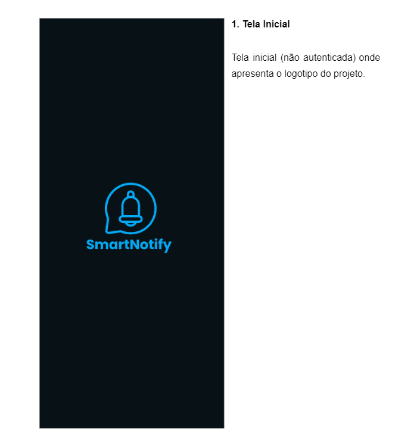
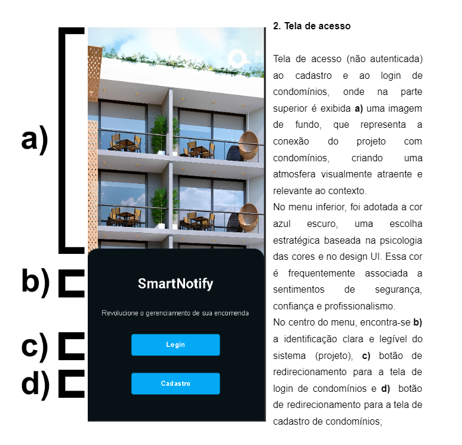
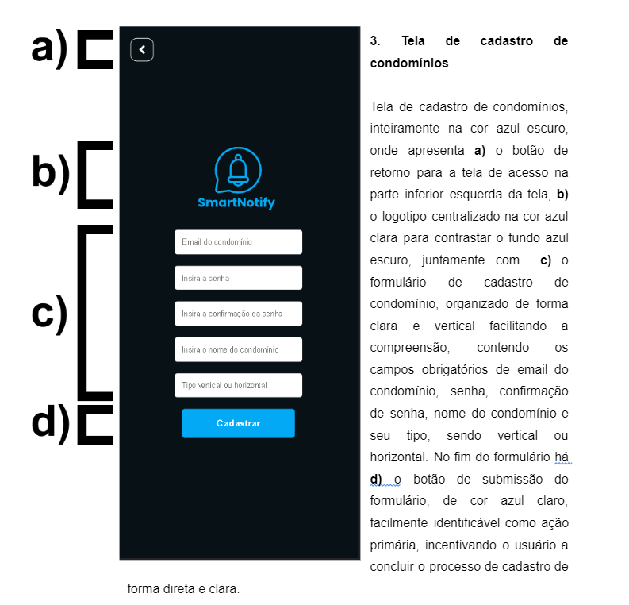
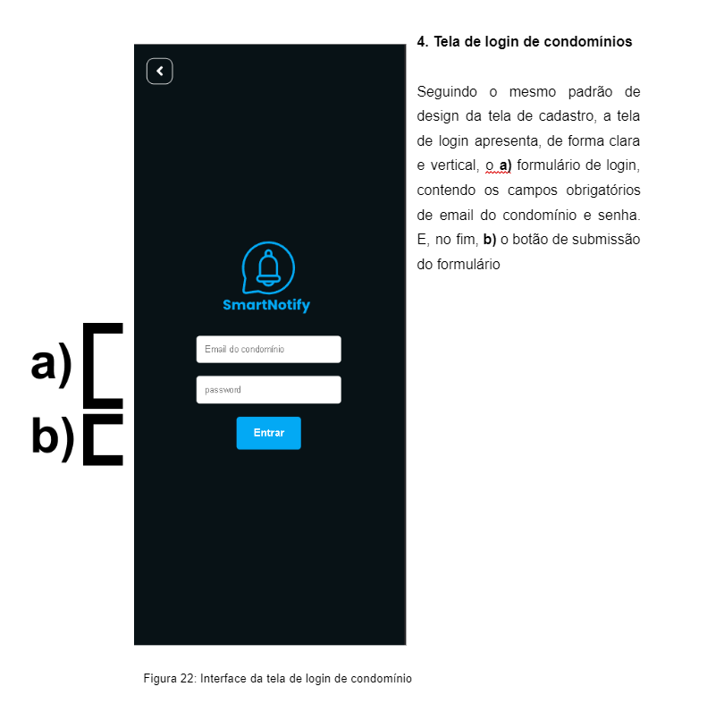
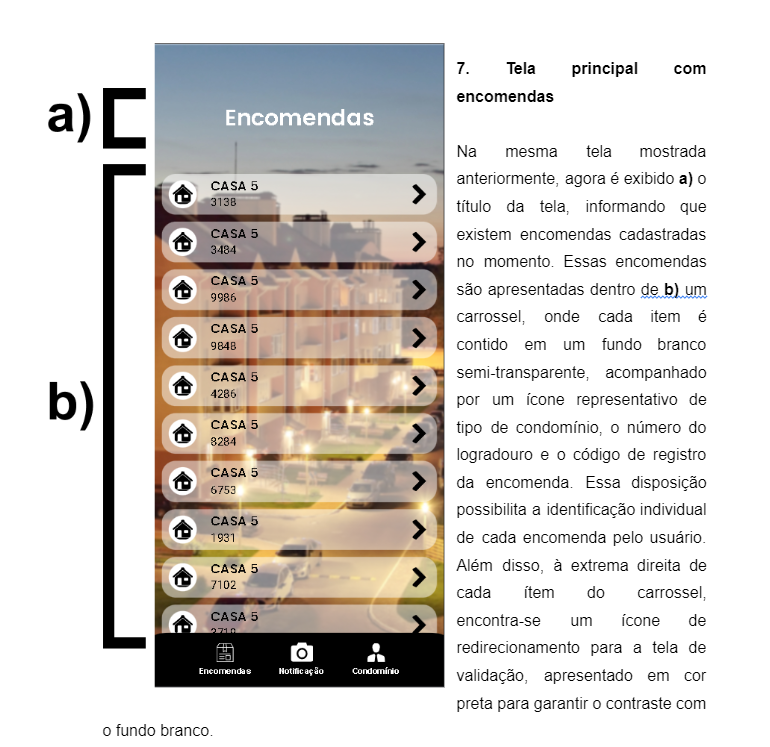
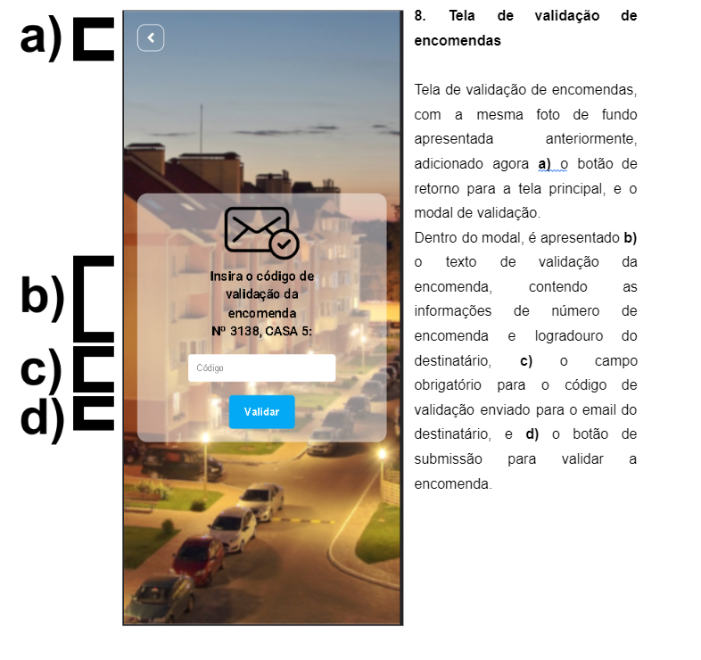
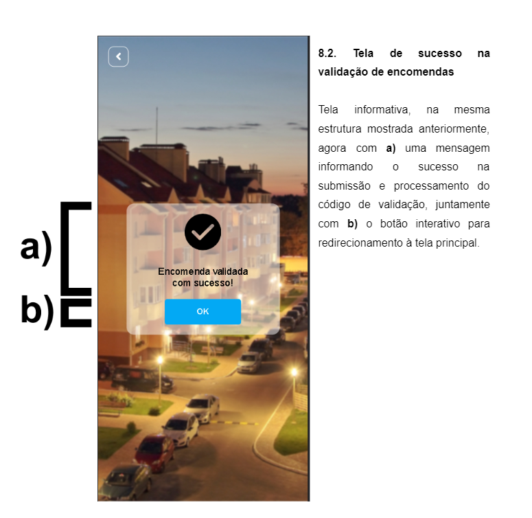

# pwa-smartnotify
Trabalho de Conclusão de Curso apresentado à Banca examinadora da Pontifícia Universidade Católica de São Paulo, como exigência parcial para obtenção do título de Bacharel em Ciência da Computação, sob a orientação do Professor Doutor Carlos Eduardo de Barros Paes.

Um README é uma parte crucial da documentação de qualquer projeto, fornecendo informações essenciais para desenvolvedores, colaboradores e usuários. Abaixo estão alguns tópicos que você pode incluir em um README para o "Smartnotify":

1. **Título e Descrição:**
   - Nome do Projeto: Smartnotify
   - Descrição: Sistema de Controle e Notificação para Entrega de Encomendas em Condomínios Residenciais.

2. **Introdução:**
   - Gerenciar encomendas em condomínios pode ser desafiador. O processo aplicado atualmente pela grande maioria das administrações de condomínios tende a ser exageradamente manual, o que ocasiona problemas de organização para notificar os moradores sobre a chegada de encomendas. Os moradores, por sua vez, enfrentam inconveniências para retirar encomendas quando não estão presentes em suas residências. Nesse contexto, é que se insere um Sistema Condominial de Notificação de Encomenda, pois o objetivo foi disponibilizar à administração uma solução que permita o cadastro de encomendas e notificação aos moradores, tal como o controle de encomendas recolhidas ou que se encontram disponíveis para retirada. Trata-se de um estudo de caso que se justifica pela necessidade de auxiliar os condôminos e melhorar sua gestão, reduzindo processos manuais. Essa solução é composta por um aplicativo Web progressivo responsável pela interface com o usuário e integração a um serviço Web, encarregado da lógica de controle do sistema. A metodologia do projeto faz uso do ICONIX, que consiste em um processo ágil e iterativo na modelagem e desenvolvimento de software.

3. **Funcionalidades Principais:**
   - Login e Logout;
   - Cadastro de condomínios residenciais verticais e horizontais;
   - Listagem das encomendas pendentes;
   - Cadastro de encomendas;
   - Validação de encomendas;
   - Adição e remoção de moradores;

5. **Requisitos do Sistema:**
   - Navegador compatível (Chrome, Firefox, Safari, Edge ou Opera);
   - Conexão a internet;

6. **Instalação:**
    ### No Android (Chrome):
    1. **Abra o PWA no Navegador:**
        - Acesse o site do PWA usando o Google Chrome no seu dispositivo Android.

    2. **Verifique se é um PWA:**
        - Certifique-se de que o site é um PWA. O Chrome geralmente exibe um ícone de "+" ou "Instalar" na barra de endereço.

    3. **Adicione à Tela Inicial:**
        - Toque no ícone de "+" ou "Instalar". O Chrome solicitará que você adicione o PWA à tela inicial do seu dispositivo.

    4. **Confirme a Instalação:**
        - Confirme a instalação adicionando o PWA à tela inicial. O ícone do PWA agora aparecerá como um aplicativo independente.

    ### No iOS (Safari):
    1. **Abra o PWA no Navegador:**
        - Acesse o site do PWA usando o Safari no seu dispositivo iOS.

    2. **Adicione à Tela Inicial:**
        - Toque no ícone de compartilhamento (quadrado com uma seta para cima) na parte inferior da tela.

    3. **Adicione à Tela Inicial:**
        - Selecione "Adicionar à Tela de Início". O Safari solicitará que você dê um nome ao ícone.

    4. **Confirme a Instalação:**
        - Toque em "Adicionar". O ícone do PWA agora estará disponível na tela inicial do seu dispositivo iOS.

8. **Uso:**
     - 
     - 
     - 
     - 
     - 
     - 
     - 
     - 
     - 
     - 
     - 

9. **APIs e Integrações:**
   - O Aplicativo Web Progressivo Smartnotify consome o backend https://github.com/smart-notify/smartnotify

12. **Autores:**
    - André Torres de Queiroz
    - Caio Henrique Portella
    - Rafael Oliveira

13. **Agradecimentos:**
    - Especialmente aos desenvolvedores, pelos sacrifícios, dedicação e comprometimento a esse projeto.
